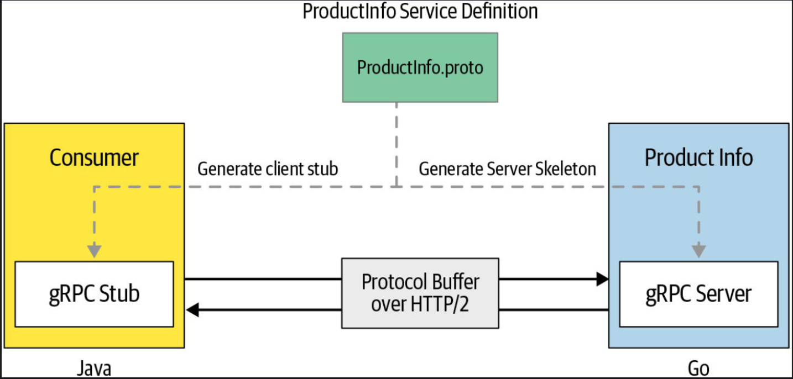

# gRPC :: go

## Intro

 * g(Depends on release) Remote Procedure Call
 * Use Interface Definition Language (protocol buffers here) to define your Service Interface 
 * Use the service interface to generate Server Skeleton and Client Stub

 

 ### Define a Proto file 

* Refer to [Version.proto](./Intro/Version.proto)
* Once we have our proto file ready, we need to generate client and server stubs.
> 1. Initialize a new go module
>> go mod init \<module\>
> 2. Generate the stubs
> 3. Implement a logic 
> 4. Deploy the service.

* Protoc plugin : `go get -u github.com/golang/protobuf/protoc-gen-go`
```
protoc  ./Version.proto --go_out=.    

Compiles Version.proto files and generates the pb files in ./(go_package)
```


